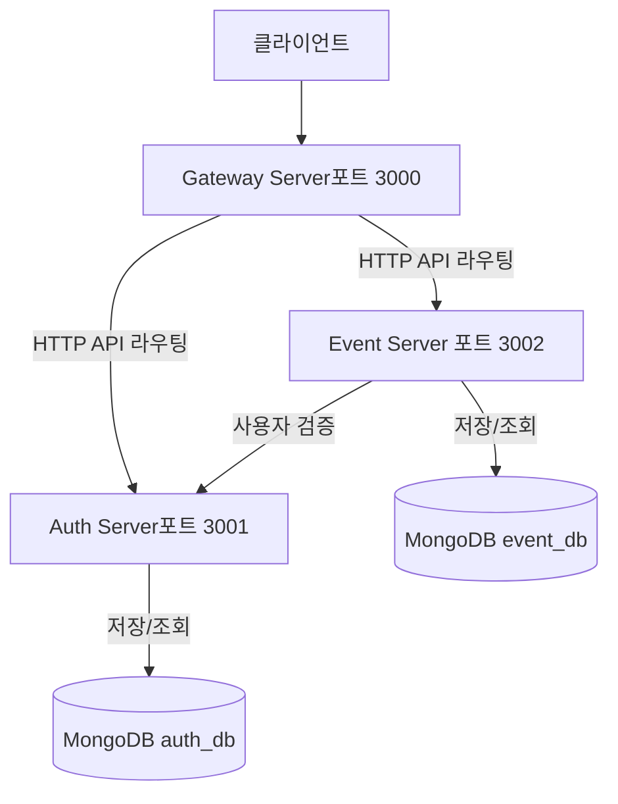
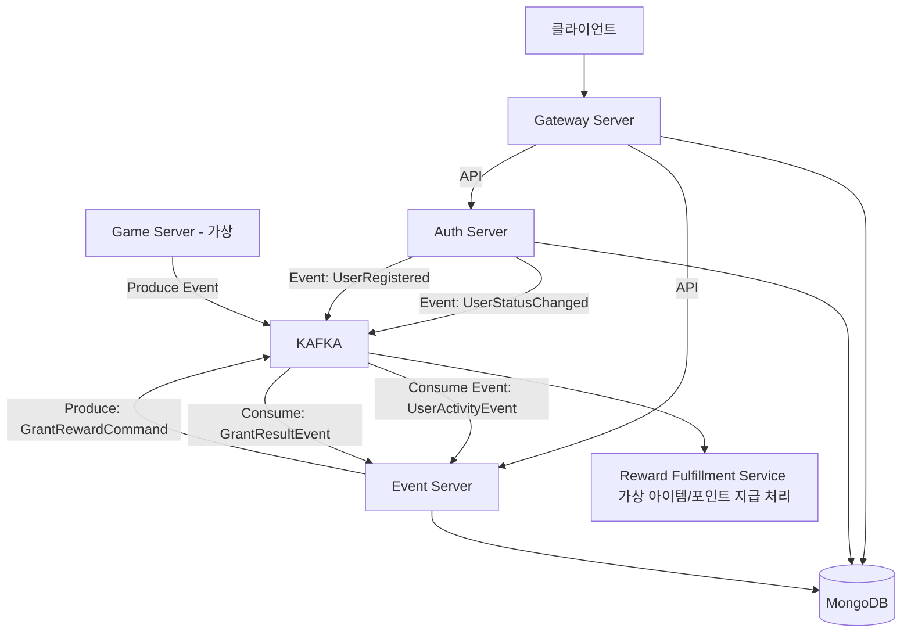

# 시스템 아키텍처 및 서버 역할

## A. 현재 시스템 아키텍처 (동기 API 기반)

### 주요 흐름 (현재)

1. 모든 클라이언트 요청은 Gateway Server를 통해 각 담당 서버(Auth Server, Event Server)로 라우팅됨
2. 서비스 간 통신은 주로 동기식 HTTP API 호출을 사용
    - 예: Event Server가 보상 요청 처리 시 Auth Server에 사용자 유효성 검증 API 호출
    - 예: Event Server가 이벤트 조건 검증을 위해 (가상의) Game Data API를 호출하거나, 보상 지급을 위해 (가상의) Item/Point System API를 호출
3. 각 서버는 자신의 데이터를 MongoDB에 저장하고 조회

## B. 각 서버별 책임(Responsibilities) 정의

### 1. Gateway Server

- **API 진입점**: 모든 외부 HTTP 요청의 단일 진입점 역할
- **인증**: Auth Server에서 발급된 JWT 토큰 유효성 검증 (`@nestjs/passport`, `passport-jwt` 활용)
- **권한 부여**: 검증된 사용자 역할(Role)에 기반한 API 접근 권한 검사 (NestJS의 `Guards` 활용)
- **요청 라우팅**: 인증/권한 검사를 통과한 요청을 적절한 내부 마이크로서비스로 전달

### 2. Auth Server

- **사용자 정보 관리**: 계정 생성, 조회, 수정, 삭제(논리적 삭제) (비밀번호는 해시로 저장)
- **사용자 인증**: 로그인 요청 처리 (사용자 정보 검증 및 JWT 발급)
- **역할 관리**: 사용자에게 역할(USER, OPERATOR, AUDITOR, ADMIN) 정보 관리
- **JWT 관리**: JWT 토큰 생성, (필요시) 리프레시 토큰 관리
- **DB**: `auth_db` 사용 (예: `users` 컬렉션)

### 3. Event Server

- **이벤트 관리**: 이벤트 생성, 조회(목록/상세), 수정, 상태 변경(활성/비활성/종료 등)
- **보상 관리**: 이벤트에 연결된 보상 정보(종류, 수량, 조건 등) 등록, 조회, 수정
- **조건 검증 로직**: 사용자 이벤트 조건 달성 여부 검증 (이 과제에서는 Mock 또는 단순화된 로직으로 처리)
- **사용자 보상 요청 처리**: 보상 요청 접수, 조건 검증, 재고 확인, 보상 지급, 요청 상태 기록 **(멱등성 및 Saga 패턴 적용 핵심 영역)**
- **보상 요청 이력 관리**: 사용자 보상 요청 성공/실패 이력 저장 및 조회
- **DB**: `event_db` 사용 (예: `events`, `rewards`, `user_reward_requests` 컬렉션)

## C. 향후 확장성을 고려한 아키텍처 (Kafka 도입 시나리오)

현재는 핵심 기능 구현에 집중했지만, 다음과 같은 상황에서 메시지 큐 시스템(Kafka) 도입을 고려할 수 있음.

### 고려 상황

1. **인게임 이벤트 연동**: 게임 서버에서 발생하는 대량의 활동 데이터(접속, 퀘스트 완료, 아이템 획득/사용, 레벨업 등)를 실시간으로 수집하여 이벤트 조건 달성 여부 판정에 활용해야 할 때
2. **비동기 처리 강화**: 복잡한 보상 지급 프로세스나 사용자 알림 발송 등을 비동기적으로 처리해 API 응답 시간을 단축하고 시스템 처리량을 높여야 할 때
3. **서비스 간 의존성 심화 방지**: 특정 서비스 장애가 다른 서비스에 영향을 최소화하고, 각 서비스가 독립적으로 확장/배포될 수 있는 유연성 확보가 필요할 때

### Kafka 도입 시 예상 아키텍처 (개념도)

### 주요 변경 및 기대 효과

- **Game Server → Kafka → Event Server**: 게임 내 활동 데이터가 Kafka를 통해 Event Server로 비동기 전달. 이로 인해 API 호출 부담 감소 및 대량 이벤트 안정적 처리 가능
- **Auth Server → Kafka → Event Server**: 사용자 상태 변경(탈퇴, 밴 등) 이벤트를 Kafka로 발행하여 Event Server가 구독 후 관련 로직 비동기 수행
- **Event Server 보상 지급 비동기화**: 보상 지급 요청 접수 후 실제 지급 처리를 위한 커맨드성 이벤트를 Kafka로 발행하여 보상 지급 API 응답성 향상 및 외부 시스템 장애 파급 효과 감소

### Kafka 도입 시 추가 고려사항

- 메시지 스키마 정의 및 관리 (Avro)
- 컨슈머의 멱등성 보장
- Dead Letter Queue (DLQ) 처리 전략
- 카프카 클러스터 운영 및 모니터링
- 트랜잭션 관리 복잡성 증가 (특히 Choreography 기반 Saga)

**결론: 현재는 동기식 API 기반으로 핵심 기능 구현하되, 확장 시나리오를 염두에 두고 API 인터페이스와 내부 로직을 설계해 향후 메시징 시스템을 점진적으로 통합할 수 있는 기반 마련이 중요함.**
