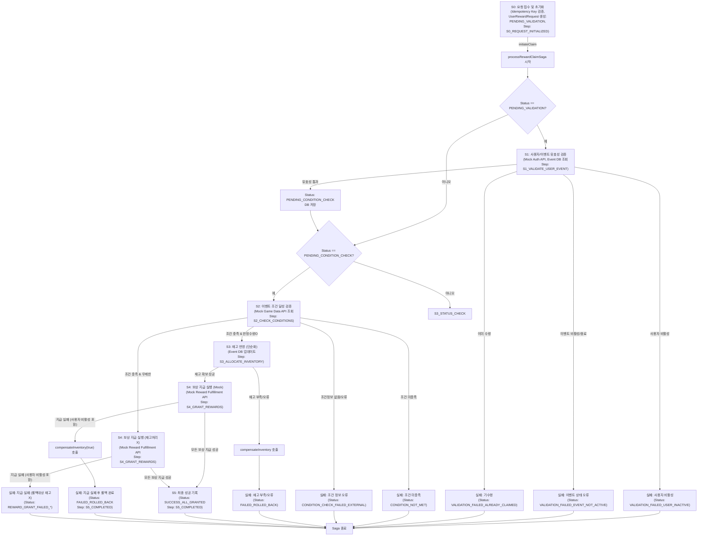
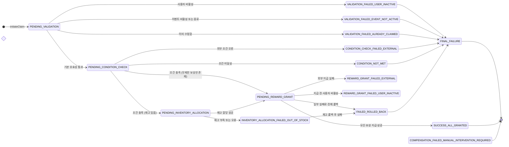
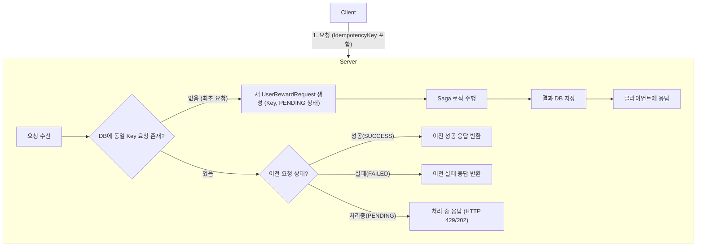

# Saga 패턴 및 멱등성(Idempotency) 설계

## 1. 서론

본 문서는 "이벤트 / 보상 관리 플랫폼"의 핵심 트랜잭션인 **사용자 보상 요청 처리** 과정의 안정성 및 데이터 일관성 확보를 위한 Saga 패턴 적용 전략과 API 요청의 멱등성 확보 방안을 상세히 기술한다.

마이크로서비스 아키텍처(MSA) 환경에서 발생 가능한 부분적 실패(Partial Failures)에 효과적으로 대응하고, 모든 사용자에게 일관된 서비스 경험을 제공하는 것을 목표.

본 설계는 현재 `EventClaimsService`에 구현된 동기식 Orchestration Saga와 `EventsService`의 재고 관리 로직을 기준으로 하며, 향후 비동기 메시지 큐(예: Apache Kafka) 도입을 통한 확장 가능성 논의

## 2. 사용자 보상 요청 처리 Saga (User Reward Claim Saga)

### 2.1. Saga 정의, 목표 및 참여 액터

- **Saga 명칭:** 사용자 보상 요청 처리 (User Reward Claim Saga)
- **핵심 목표:**
    - 사용자의 특정 이벤트에 대한 보상 요청 접수 및 유효성 검증 (사용자 상태, 이벤트 상태, 기수령 여부).
    - 이벤트 조건 충족 여부의 정확한 판정 (현재는 `EventClaimsService` 내 Mock 로직 사용).
    - 한정 수량 보상의 경우, 재고의 일관성 있는 확인 및 차감 (`EventsService`의 DB 조건부 업데이트 활용, `EventClaimsService`에서 호출).
    - 검증된 조건 및 재고 상태 기반의 보상 지급 실행 (외부 시스템 연동은 `EventClaimsService` 내 Mock 인터페이스로 가정).
    - Saga 전 과정의 상태 변화를 `UserRewardRequest` 문서에 상세히 기록 및 추적.
    - Saga 진행 중 예외 발생 시, 기완료된 선행 단계 작업의 안전한 **롤백(보상 트랜잭션 실행)**을 통한 데이터의 최종적 일관성(Eventual Consistency) 보장.
- **주요 참여 액터 및 역할:**
    - **Client (사용자 인터페이스):** 보상 요청 API (`POST /api/event-claims/{eventId}/claim`) 호출 (`X-Idempotency-Key` 헤더 포함).
    - **Gateway Server (`EventClaimProxyController` 등):** API 요청 수신, 1차 인증(JWT 유효성 검증), `event-server`로 프록시. `X-User-ID`, `X-User-Roles`, `X-User-Name` 헤더를 통해 인증된 사용자 식별 정보 전달.
    - **Event Server (주 담당: `event-claims.service.ts`의 `EventClaimsService`):**
        - 본 Saga의 <strong>Orchestrator</strong> 역할 수행.
        - `UserRewardRequest` 상태 객체를 통한 Saga 인스턴스 상태 관리 및 영속화.
        - 각 Saga 단계별 비즈니스 로직 실행 (`processRewardClaimSaga` 메서드) 및 결과 기록.
        - 필요시 타 서비스(Auth Server Mock, Game Data Service Mock, Reward Fulfillment Service Mock) 호출.
        - `events.service.ts`의 `eventModel`을 사용하여 이벤트 정보 조회 및 재고 업데이트/롤백 (`compensateInventory` 메서드 내에서).
        - 단계별 실패 감지 및 정의된 보상 트랜잭션 실행 지시.
    - **(Mock) Auth Service (`EventClaimsService` 내 `mockAuthService`):** `isUserActive`를 통해 사용자 활성 상태 확인.
    - **(Mock) Game Data Service (`EventClaimsService` 내 `mockGameDataService`):** `checkConditions`를 통해 이벤트 조건 달성 여부 확인.
    - **(Mock) Reward Fulfillment Service (`EventClaimsService` 내 `mockRewardFulfillmentService`):** `grantReward`를 통해 실제 보상 지급 시뮬레이션.

### 2.2. Saga 전체 흐름도 (High-Level Flowchart)

사용자 보상 요청 처리 Saga의 전체적인 진행 흐름. `UserRewardRequest`의 `status`와 `currentSagaStep` 변화와 밀접하게 연관. (실제 `EventClaimsService`의 `processRewardClaimSaga` 메서드 흐름 기반)



- **설명:** `EventClaimsService`의 `initiateClaim`과 `processRewardClaimSaga` 메서드의 실제 로직 흐름을 반영하여,
- 각 단계의 상태 확인(`if (currentRequest.status === ...)`), 주요 작업, 성공/실패 시 상태 변경, 그리고 보상 트랜잭션(`compensateInventory`) 호출 지점을 시각화합니다.

### 2.3. `UserRewardRequest` 상태 전이 다이어그램 (State Transition Diagram)

- `UserRewardRequest` 문서의 `status` 필드는 Saga 진행 상황의 핵심 지표.
- 가능한 모든 상태와 상태 간 전이 조건은 아래와 같음.



- **설명:** 각 원은 `UserRewardRequest`의 `status` 값을 나타내며, 화살표는 상태 전이와 주요 원인(Saga 단계/이벤트)을 의미.
- `INVENTORY_ALLOCATED`는 `UserRewardRequest.rewardsToProcess[i].grantStatus`로 관리하고,
  전체 요청의 `status`는 `PENDING_REWARD_GRANT`로 진행되는 것으로 변경되었습니다.
- 실패 후 `compensateInventory`를 거쳐 최종적으로 `FAILED_ROLLED_BACK` 상태로 수렴되는 것을 명확히 합니다.

### 2.4. 현재 설계: 동기 API 호출 기반 Orchestration Saga 상세 (`EventClaimsService` 로직 기반)

`EventClaimsService`는 Saga Orchestrator로서, `processRewardClaimSaga` 메서드 내에서 각 단계를 순차적으로 진행한다.

`UserRewardRequest` 문서를 통해 상태를 지속적으로 관리하며, 실패 시 `compensateInventory`와 같은 보상 트랜잭션을 호출한다. 외부 서비스 연동은 Mock 인터페이스를 통해 시뮬레이션한다.

- **S0: 요청 접수 및 초기화 (`initiateClaim` 메서드)**
    - **입력:** `userId`, `eventIdString`, `idempotencyKey`, `userRoles`, `username`.
    - **주요 로직:**
        1. **멱등성 검증:** `requestId` (from `idempotencyKey`)로 `UserRewardRequest` 조회. 기존 요청 발견 시 해당 요청의 현재 `status`에 따라 즉시 반환 (성공, 실패, 처리 중 상태 구분).
        2. 대상 `Event` 문서(`eventModel.findById`) 조회. 유효성(존재 여부) 확인.
        3. 신규 `UserRewardRequest` 문서 생성: `requestId`, `userId`, `eventId`, `eventSnapshot` (이벤트명, 조건, 보상 목록 스냅샷), `status: 'PENDING_VALIDATION'`, `currentSagaStep: 'S0_REQUEST_INITIALIZED'`, `rewardsToProcess` (지급 대상 보상 목록 및 각 보상별 초기 `grantStatus: 'PENDING'`) 초기화.
        4. DB 저장: 생성된 `UserRewardRequest` 문서 저장. (`requestId` unique 인덱스로 동시 요청에 의한 중복 생성 방지).
        5. **Saga 실행:** `processRewardClaimSaga(savedRequest)` 호출. (현재 동기적 실행 후 최종 결과 반환)
    - **출력 (API 응답):** Saga 처리 후 최종 업데이트된 `UserRewardRequest` 문서.
- **S1: 사용자 및 이벤트 유효성 검증 (`processRewardClaimSaga` 내)**
    - `currentSagaStep = 'S1_VALIDATE_USER_EVENT'`.
    - `mockAuthService.isUserActive(userId)` 호출. 사용자 비활성 시 `status = 'VALIDATION_FAILED_USER_INACTIVE'`, Saga 중단.
    - `eventModel.findById(eventId)`로 최신 이벤트 정보 조회. 이벤트 `status`가 'ACTIVE'가 아니거나 기간 만료 시 `status = 'VALIDATION_FAILED_EVENT_NOT_ACTIVE'`, Saga 중단.
    - `userRewardRequestModel.findOne({ userId, eventId, status: 'SUCCESS_ALL_GRANTED' })`로 중복 수령 검증. 중복 시 `status = 'VALIDATION_FAILED_ALREADY_CLAIMED'`, Saga 중단.
    - 모든 검증 통과 시 `status = 'PENDING_CONDITION_CHECK'`. 각 단계 후 `request.save()`.
- **S2: 이벤트 조건 달성 여부 검증 (`processRewardClaimSaga` 내)**
    - `currentSagaStep = 'S2_CHECK_CONDITIONS'`.
    - `request.eventSnapshot.conditions` 기반, `mockGameDataService.checkConditions(userId, conditions)` 호출.
    - 조건 미달성 시 `status = 'CONDITION_NOT_MET'`, Saga 중단. `eventSnapshot.conditions` 부재 시 `CONDITION_CHECK_FAILED_EXTERNAL` 처리.
    - 성공 시, `rewardsToProcess` 내 한정 수량 보상 존재 여부 확인 후 `status`를 `PENDING_INVENTORY_ALLOCATION` 또는 `PENDING_REWARD_GRANT`로 설정.
- **S3: 보상 재고 확인 및 반영 (`processRewardClaimSaga` 내, 한정 수량 보상 존재 시)**
    - `currentSagaStep = 'S3_ALLOCATE_INVENTORY'`.
    - 최신 `Event` 문서 재조회 (`eventForInventory`).
    - `rewardsToProcess` 순회. 각 `snapshotReward`에 대해 `eventForInventory.rewards`에서 일치하는 `eventReward` 탐색.
        - `eventReward` 부재 시 오류 처리 (`FAILED_INVENTORY_ERROR`로 `grantStatus` 변경 후 전체 롤백).
        - 한정 수량 보상(`totalStock != -1`): `remainingStock > 0` 확인 후 `eventModel.updateOne`으로 `rewards.$.remainingStock` 조건부 차감.
            - 업데이트 성공: `rewardToProcess.grantStatus = 'INVENTORY_ALLOCATED'`.
            - 실패(재고 부족/경쟁): `rewardToProcess.grantStatus = 'FAILED_OUT_OF_STOCK'`, 전체 재고 할당 실패(`allStockAllocated = false`), 루프 중단.
        - 무제한 보상: `rewardToProcess.grantStatus = 'INVENTORY_ALLOCATED'`.
    - `currentRequest.markModified('rewardsToProcess')`.
    - `allStockAllocated == false` 시: `status = 'INVENTORY_ALLOCATION_FAILED_OUT_OF_STOCK'`, `compensateInventory(eventForInventory)` 호출 후 `status = 'FAILED_ROLLED_BACK'`. Saga 중단.
    - 전체 성공 시: `status = 'PENDING_REWARD_GRANT'`.
- **S4: 실제 보상 지급 (Mock, `processRewardClaimSaga` 내)**
    - `currentSagaStep = 'S4_GRANT_REWARDS'`.
    - `rewardsToProcess` 중 `grantStatus = 'INVENTORY_ALLOCATED'`인 보상에 대해:
        1. `mockAuthService.isUserActive(userId)`로 사용자 상태 최종 확인. 비활성 시 `status = 'REWARD_GRANT_FAILED_USER_INACTIVE'`, 전체 롤백 플래그 설정 후 루프 중단.
        2. `mockRewardFulfillmentService.grantReward(userId, rewardDetails)` 호출.
        3. 결과에 따라 `rewardsToProcess` 각 항목의 `grantStatus`를 `SUCCESS` 또는 `FAILED_EXTERNAL`로, `processedAt`, `failureReason` 업데이트. 실패 시 전체 롤백 플래그 설정 후 루프 중단.
    - `currentRequest.markModified('rewardsToProcess')`.
    - `allRewardsGrantedSuccessfully == false` 시: `status` 업데이트 (예: `REWARD_GRANT_FAILED_EXTERNAL`), `compensateInventory(event, true)` 호출 후 `status = 'FAILED_ROLLED_BACK'`. Saga 중단.
    - 모든 보상 지급 성공 시: `status = 'SUCCESS_ALL_GRANTED'`, `rewardsGrantedAt` 기록.
- **S5: 최종 처리 (`processRewardClaimSaga` 내)**
    - `currentSagaStep = 'S5_COMPLETED'`.
    - `UserRewardRequest` 최종 상태 로깅 및 저장.
- **Saga 전체 예외 처리 (`processRewardClaimSaga` 최상단 `try-catch`):**
    - 예상치 못한 오류 발생 시, `status = 'COMPENSATION_FAILED_MANUAL_INTERVENTION_REQUIRED'`, `failureReason` 기록 후 DB에서 최신 상태의 문서를 다시 읽어와 안전하게 저장 시도.
- **보상 트랜잭션 (`compensateInventory` 메서드):**
    - 입력: `UserRewardRequestDocument`, `EventDocument`, `isGrantFailureRollback` (S4 실패 롤백 여부).
    - 로직: `rewardsToProcess`를 순회하며, `grantStatus`가 `INVENTORY_ALLOCATED`였거나 (S3 실패 시나리오), `isGrantFailureRollback`이 `true`이고 `grantStatus`가 `SUCCESS`였던 (S4에서 지급 성공 후 전체 롤백 시나리오) 한정 수량 보상에 대해 `eventModel.updateOne`으로 `rewards.$.remainingStock` 1 증가. 롤백된 보상의 `grantStatus`를 `ROLLED_BACK_INVENTORY`로 업데이트. `request.markModified('rewardsToProcess')`.

### 2.5. 현재 설계(동기 API 기반 Orchestration Saga)의 어려움 및 한계점

현재 구현된 동기식 API 호출 기반의 Orchestration Saga는 제어 흐름이 명확하다는 장점이 있으나, 다음과 같은 본질적인 어려움과 한계점을 지닙니다. 특히 시스템의 규모가 커지고 트랜잭션의 복잡도가 증가할수록 이러한 문제점들은 더욱 심화될 수 있습니다.

1. **롤백(보상 트랜잭션) 로직의 중앙 집중화 및 복잡성 증대:**
    - **오류 처리 책임 집중:** Saga의 모든 단계를 총괄하는 Orchestrator(본 설계에서는 `EventClaimsService`)는 각 로컬 트랜잭션의 실패를 감지하고, 그에 따른 보상 트랜잭션을 순차적으로 실행해야 하는 모든 책임을 지게 됩니다. 이는 Orchestrator의 코드 복잡도를 현저히 높이며, 새로운 Saga 단계가 추가되거나 기존 로직이 변경될 때마다 관련된 보상 로직 또한 함께 수정하고 검증해야 하는 유지보수 부담을 야기합니다.
    - **구현의 난이도:** 각 서비스 호출(S1부터 S4에 이르는 사용자 검증, 조건 확인, 재고 차감, 보상 지급 등)에 대한 보상 로직(예: 재고 원복 DB 업데이트, 지급된 보상 회수 API 호출 등)을 Orchestrator가 일일이 관리하고 호출 순서 및 성공 여부를 확인해야 합니다. 이 과정에서 누락이나 오류가 발생할 가능성이 높으며, 디버깅 또한 쉽지 않습니다.
    - **상태 관리의 복잡성:** 실패가 발생한 정확한 지점과 이미 성공적으로 완료된 작업들을 명확히 추적하여, 올바른 보상 조치를 정확한 순서로 적용하기 위한 상태 관리가 매우 중요해집니다. 이는 Orchestrator의 로직을 더욱 복잡하게 만드는 요인으로 작용합니다.
2. **서비스 간 강한 결합(Tight Coupling) 및 성능 병목 가능성:**
    - **실행 시간의 직접적 의존성:** `EventClaimsService`가 Auth Server, (가상) Game Data Service, (가상) Reward Fulfillment Service 등 외부 서비스를 동기적으로 호출하는 현재 방식은, 호출 대상 서비스 중 단 하나라도 응답이 지연될 경우 전체 보상 요청 Saga의 처리 시간이 직접적으로 늘어나는 결과를 초래합니다. 여러 외부 시스템과 순차적으로 통신해야 하는 복잡한 Saga의 경우, 이러한 지연은 누적되어 최종 사용자의 경험에 부정적인 영향을 미칠 수 있습니다.
    - **가용성의 연쇄적 영향:** 호출 대상 서비스 중 하나라도 장애가 발생하여 정상적인 응답을 반환하지 못하면, Orchestrator는 해당 단계에서 더 이상 진행하지 못하고 블로킹되거나, 설정된 타임아웃 이후에 Saga를 강제로 실패시켜야 합니다. 이는 특정 외부 서비스의 장애가 전체 보상 시스템의 가용성에 직접적인 영향을 미치는 강한 결합 상태를 의미하며, 시스템 전체의 안정성을 저해할 수 있습니다.
    - **Resilience 패턴 구현 부담의 집중:** 각 동기 API 호출 지점마다 Timeout 설정, 제한적 재시도(Retry) 로직 (호출 대상 API가 멱등성을 보장할 경우), 그리고 반복적인 실패에 대한 Circuit Breaker 패턴 등을 Orchestrator 내부 또는 각 API 호출 클라이언트 라이브러리 수준에서 개별적으로 구현하고 관리해야 하는 부담이 있습니다.
3. **긴 트랜잭션(Long-Lived Transactions)으로 인한 시스템 자원 점유:**
    - Saga의 모든 단계가 동기적으로 처리되므로, 첫 단계부터 최종 완료 또는 실패까지 관련된 시스템 자원(예: 데이터베이스 커넥션, 서버의 요청 처리 스레드 또는 이벤트 루프 점유)이 장시간 동안 유지될 수 있습니다. 동시에 처리해야 할 보상 요청 트랜잭션의 수가 증가할 경우, 이는 시스템 전체의 가용 자원을 빠르게 소진시켜 성능 저하를 유발하거나 심지어 서비스 불능 상태로 이어질 수 있습니다.

위에서 언급된 어려움들은 "일일이 트랜잭션 다 되돌리는 게 너무 빡세다"는 사용자님의 직관적인 우려와 정확히 일치합니다. 시스템의 초기 단계나 트랜잭션의 복잡도 및 빈도가 낮은 경우에는 현재의 동기식 Orchestration 방식으로 관리 가능할 수 있으나, 서비스가 성장하고 이벤트 및 보상 시스템의 역할이 중요해짐에 따라 이러한 구조는 유지보수성과 확장성 측면에서 심각한 도전에 직면하게 될 가능성이 높습니다.

### 2.6. 향후 확장 설계: Apache Kafka 도입을 통한 Saga 개선 방안

현재 설계된 동기 API 기반 Orchestration Saga의 한계점을 극복하고, 시스템의 확장성, 유연성,

그리고 서비스 간 결합도를 획기적으로 개선하기 위한 핵심 전략으로 메시지 큐 시스템을 도입하여 이벤트 기반 아키텍처(Event-Driven Architecture, EDA)로 점진적으로 전환하는 것을 고려.

- **핵심 목표:**
    - 각 마이크로서비스의 책임을 명확히 분리하고, 서비스 간 직접적인 동기 호출 의존성을 제거함으로써 **느슨한 결합(Loose Coupling)**을 달성합니다.
    - 시간이 많이 소요되거나 외부 시스템에 의존적인 작업을 **비동기 이벤트 처리**로 전환하여, API 응답성을 향상시키고 시스템 전체의 처리량(Throughput)을 증대시킵니다.
    - Saga의 각 단계를 독립적인 이벤트로 정의하고, 실패 발생 시 각 서비스가 **보상 이벤트**를 통해 자신의 책임을 다하도록 함으로써 롤백 로직의 복잡성을 효과적으로 분산시킵니다.
- **개선 방안 1: Choreography 기반 Saga (이벤트 기반 완전 분산 처리)**
    - **개념:** 중앙 Orchestrator 없이, 각 마이크로서비스가 자신의 로컬 트랜잭션을 성공적으로 완료한 후, 그 결과를 나타내는 도메인 이벤트를 Kafka의 특정 토픽으로 발행(Publish)합니다. 이 Saga에 참여하는 다른 서비스들은 자신이 관심 있는 이벤트를 구독(Subscribe)하여, 해당 이벤트가 발생하면 자신의 다음 작업을 수행하고, 필요하다면 또 다른 도메인 이벤트를 발행하는 연쇄적인 방식으로 전체 Saga가 진행됩니다.
    - **개념도:**코드 스니펫

        ```mermaid
        graph LR
            %% Event Server API
            subgraph Event_Server_API
                A[API 요청 수신] --> B[RewardClaimInitiatedEvent 발행]
            end
        
            B --> C[Kafka Topic: reward-claims-initiated]
        
            %% Validator Service
            subgraph Validator_Service
                C -- RewardClaimInitiatedEvent --> D{사용자/이벤트 검증}
                D -- 유효 --> E[ClaimValidatedEvent 발행]
                D -- 무효 --> F[ClaimValidationFailedEvent 발행]
            end
        
            E --> K_Validated[Kafka Topic: claim-validated]
            F --> K_Failed[Kafka Topic: claim-validation-failed]
        
            %% Condition Checker
            subgraph Condition_Checker
                K_Validated -- ClaimValidatedEvent --> G{조건 검증}
                G -- 충족 --> H[ConditionMetEvent 발행]
                G -- 미충족 --> I[ConditionNotMetEvent 발행]
            end
        
            H --> K_ConditionMet[Kafka Topic: condition-met]
            I --> K_ConditionFailed[Kafka Topic: condition-not-met]
        
            %% Inventory Service
            subgraph Inventory_Service
                K_ConditionMet -- ConditionMetEvent --> J{재고 할당}
                J -- 성공 --> K_InvAlloc[InventoryAllocatedEvent 발행]
                J -- 실패 --> L_InvFail[InventoryAllocationFailedEvent 발행]
            end
        
            K_InvAlloc --> K_InventoryAllocated[Kafka Topic: inventory-allocated]
            L_InvFail --> K_InventoryFailed[Kafka Topic: inventory-failed]
        
            %% Reward Granter
            subgraph Reward_Granter
                K_InventoryAllocated -- InventoryAllocatedEvent --> M{보상 지급 시도}
                M -- 성공 --> N_Granted[RewardGrantedEvent 발행]
                M -- 실패 --> O_Failed[RewardGrantFailedEvent 발행]
            end
        
            N_Granted --> K_RewardGranted[Kafka Topic: reward-granted]
            O_Failed --> K_RewardGrantFailed[Kafka Topic: reward-grant-failed]
        
            %% Finalizer Service
            subgraph Finalizer_Service
                K_RewardGranted --> P_Success[최종 성공 상태 업데이트]
                K_RewardGrantFailed --> P_Fail[실패 상태 업데이트 및 트리거]
                K_InventoryFailed --> P_Fail
                K_ConditionFailed --> P_Fail
                K_Failed --> P_Fail
            end
        
            %% Compensation Handlers
            subgraph Compensation_Handlers
                K_RewardGrantFailed --> R_CompInv[재고 롤백 이벤트 처리]
                K_InventoryFailed --> R_CompPrev[이전 단계 보상 처리]
            end
        
        ```

    - **장점:** 서비스 간 결합도가 극도로 낮아져 각 서비스의 독립적인 개발, 배포, 확장이 매우 용이해집니다. 특정 서비스의 장애가 다른 서비스에 미치는 영향이 최소화됩니다 (시간적 분리 - Temporal Decoupling). 각 서비스는 자신의 책임에만 집중할 수 있습니다.
    - **단점 및 과제 적용 시 고려사항:**
        - **전체 Saga 흐름 추적 및 모니터링의 어려움:** 중앙 관제탑이 없으므로 전체 트랜잭션이 현재 어떤 상태인지, 어디서 문제가 발생했는지 파악하기 위한 별도의 분산 추적(Distributed Tracing) 또는 Saga 상태 관리 메커니즘이 필요할 수 있습니다.
        - **보상 트랜잭션 관리의 복잡성 증대:** 각 서비스는 자신이 발행한 이벤트에 대한 보상 이벤트를 스스로 발행하거나, 다른 서비스의 실패 이벤트를 구독하여 자신의 보상 로직을 실행해야 합니다. 전체적인 롤백 흐름을 설계하고 관리하기가 동기식 Orchestration보다 복잡할 수 있습니다. (예: 특정 실패 이벤트 발생 시, 이를 구독하는 여러 서비스가 각자의 보상 트랜잭션을 수행해야 함).
        - **타임아웃 및 전체 Saga 실패 감지:** 특정 단계에서 다음 단계로의 진행을 알리는 응답 이벤트가 오랫동안 발행되지 않을 경우 타임아웃을 어떻게 처리할 것인지, 여러 이벤트의 조합으로 최종 Saga의 성공 또는 실패를 어떻게 판정할 것인지 등의 로직이 복잡해집니다.
        - **이벤트 순서 보장 및 중복 처리:** 메시지 큐의 특성에 따라 이벤트 순서가 보장되지 않거나, 컨슈머 장애 시 동일 이벤트가 중복으로 처리될 수 있습니다. 이에 대한 대비(컨슈머 멱등성, 순서 보장 메커니즘)가 필요합니다.
        - **본 과제에서는 시간 제약 및 복잡도 증가로 인해 완전한 Choreography 기반 Saga 구현은 권장되지 않으나, Kafka를 통한 비동기 통신과 이벤트 기반 아키텍처의 개념적 이해를 보여주는 것은 매우 가치 있습니다.**
- **개선 방안 2: Orchestration과 Event를 결합한 하이브리드 Saga (현실적 절충안 - 본 과제에서 설계적으로 제안하기 좋은 방향)**
    - **개념:** 여전히 `EventClaimsService`와 같은 Orchestrator가 Saga의 전체적인 흐름을 제어하고 `UserRewardRequest`의 상태를 관리합니다.
    - 하지만, 시간이 오래 걸리거나 외부 시스템에 강하게 의존하는 각 **Saga 단계를 직접 동기 API 호출로 실행하는 대신, 해당 작업을 요청하는 "커맨드(Command)성 이벤트"를 Kafka로 발행**합니다.
    - 각 커맨드를 처리하는 전용 컨슈머(Event Server 내 별도 모듈 또는 다른 마이크로서비스)는 작업을 완료한 후
      그 결과를 **"결과(Result) 또는 도메인 이벤트"로 Kafka에 다시 발행**하고, Orchestrator는 이 결과 이벤트를 구독하여 다음 단계를 진행하거나 실패를 처리합니다.
    - **개념도:**

        ```mermaid
        sequenceDiagram
            participant Client
            participant Gateway
            participant EventSvc as EventClaimsService (Orchestrator)
            participant Kafka
            participant ConditionSvc as ConditionCheck Consumer
            participant InventorySvc as Inventory Consumer
            participant RewardSvc as RewardGrant Consumer
        
            Client->>Gateway: 보상 요청 (IdempotencyKey)
            Gateway->>EventSvc: 요청 전달 (API)
            EventSvc->>EventSvc: UserRewardRequest 생성 (status: PENDING_VALIDATION)
            Note over EventSvc: S1: 사용자/이벤트 유효성 검증 (Auth API 동기 호출)
            alt S1 유효성 통과
                EventSvc->>EventSvc: status: PENDING_CONDITION_CHECK, DB 저장
                EventSvc->>Kafka: Publish(CheckConditionCommand - requestId, userId, eventConditions)
            else S1 유효성 실패
                EventSvc->>EventSvc: status: FAILED_VALIDATION_*, DB 저장
                EventSvc-->>Gateway: 실패 응답
                Gateway-->>Client: 실패 응답
            end
        
            Kafka-->>ConditionSvc: Consume(CheckConditionCommand)
            ConditionSvc->>ConditionSvc: 조건 검증 로직 수행 ((Mock)GameData API 호출 등)
            ConditionSvc->>Kafka: Publish(ConditionCheckedEvent - requestId, met:true/false, reason)
        
            Kafka-->>EventSvc: Consume(ConditionCheckedEvent)
            EventSvc->>EventSvc: UserRewardRequest 상태 업데이트 (currentSagaStep, status 등)
            alt 조건 충족 (met:true)
                EventSvc->>Kafka: Publish(AllocateInventoryCommand - requestId, rewardsToAllocate)
            else 조건 미충족 (met:false)
                EventSvc->>EventSvc: status: CONDITION_NOT_MET, DB 저장
                EventSvc-->>Gateway: (비동기 처리 시) 별도 알림 또는 상태 조회 API 통해 결과 전달
                Gateway-->>Client: (비동기 처리 시) 별도 알림 또는 상태 조회 API 통해 결과 전달
            end
        
            Kafka-->>InventorySvc: Consume(AllocateInventoryCommand)
            InventorySvc->>InventorySvc: 재고 처리 (DB 조건부 업데이트)
            InventorySvc->>Kafka: Publish(InventoryAllocatedEvent - requestId, status:SUCCESS/OUT_OF_STOCK)
        
            Kafka-->>EventSvc: Consume(InventoryAllocatedEvent)
            EventSvc->>EventSvc: UserRewardRequest 상태 업데이트
            alt 재고 할당 성공 (status:SUCCESS)
                EventSvc->>Kafka: Publish(GrantRewardCommand - requestId, rewardsToGrant)
            else 재고 할당 실패 (status:OUT_OF_STOCK)
                EventSvc->>Kafka: Publish(CompensatePreviousStepsCommand - requestId, fromStep:S3) % 보상 커맨드
                EventSvc->>EventSvc: status: FAILED_ROLLED_BACK (또는 PENDING_COMPENSATION), DB 저장
            end
        
            Kafka-->>RewardSvc: Consume(GrantRewardCommand)
            RewardSvc->>RewardSvc: 보상 지급 ((Mock)Reward Fulfillment API 호출)
            RewardSvc->>Kafka: Publish(RewardGrantedEvent 또는 RewardGrantFailedEvent - requestId, grantStatus, rewardDetails)
        
            Kafka-->>EventSvc: Consume(RewardGrantedEvent / RewardGrantFailedEvent)
            EventSvc->>EventSvc: UserRewardRequest 상태 업데이트 (processedRewards, status 등)
            alt 모든 보상 지급 성공
                EventSvc->>EventSvc: status: SUCCESS_ALL_GRANTED, DB 저장
            else 일부/전체 보상 지급 실패
                EventSvc->>Kafka: Publish(CompensateInventoryCommand - requestId, ...) % S3 롤백 커맨드
                EventSvc->>Kafka: Publish(CompensateGrantedRewardsCommand - requestId, ...) % S4 기지급 보상 롤백 커맨드 (필요시)
                EventSvc->>EventSvc: status: FAILED_ROLLED_BACK (또는 PENDING_COMPENSATION), DB 저장
            end
        
            EventSvc-->>Gateway: (비동기 처리 시) 최종 결과 알림 또는 상태 조회 API 통해 전달
            Gateway-->>Client: (비동기 처리 시) 최종 결과 알림 또는 상태 조회 API 통해 전달
        ```

    - **장점:**
        - **흐름 제어의 명확성 유지:** Orchestrator(`EventClaimsService`)가 전체 Saga의 흐름을 알고 상태를 관리하므로, Choreography 방식보다 전체 트랜잭션을 이해하고 제어하기가 상대적으로 용이합니다.
        - **비동기 처리의 이점 활용:** 시간이 오래 걸리거나 외부 시스템에 의존적인 작업(조건 확인, 재고 할당, 실제 보상 지급 등)을 Kafka 이벤트를 통해 비동기적으로 처리함으로써, 최초 API 요청에 대한 응답 시간을 크게 단축시키고 시스템 전체의 자원 사용 효율성을 높일 수 있습니다.
        - **롤백 로직의 유연성 및 분산:** 실패 발생 시, Orchestrator는 해당 단계의 실패를 인지하고 필요한 보상 커맨드 이벤트(예: `CompensateInventoryCommand`, `RevokeGrantedRewardCommand`)를 Kafka로 발행할 수 있습니다. 이 커맨드를 구독하는 각 담당 서비스(또는 컨슈머)가 실제 롤백 작업을 수행합니다. 이를 통해 "일일이 되돌리는" 복잡한 로직이 Orchestrator에서 각 담당 서비스로 분산되면서도, 전체적인 롤백 흐름은 중앙에서 통제될 수 있습니다.
        - **Resilience 및 내결함성 향상:** Kafka가 메시지 버퍼 역할을 하므로, 특정 커맨드를 처리하는 서비스(컨슈머)가 일시적으로 다운되더라도 커맨드 이벤트는 유실되지 않고 해당 서비스가 복구된 후 나중에 처리될 수 있습니다. 각 컨슈머는 자체적인 재시도 로직, Dead Letter Queue(DLQ) 처리 등을 구현하여 안정성을 더욱 높일 수 있습니다.
    - **Kafka 도입 시 "롤백(보상 트랜잭션)" 처리의 변화:**
        - Orchestrator(`EventClaimsService`)는 더 이상 모든 보상 로직을 직접 동기 API로 호출하여 실행하지 않습니다. 대신, 예를 들어 S4(보상 지급) 단계에서 실패가 발생하면, Orchestrator는 S3(재고 할당) 단계에서 변경된 내용을 되돌리기 위해 `CompensateInventoryCommand` 이벤트를 Kafka로 발행할 수 있습니다.
        - `InventoryService`(또는 `InventoryConsumer`)는 `CompensateInventoryCommand`를 구독하여 실제 재고 원복 로직을 수행하고, 완료 후 `InventoryCompensatedEvent`를 발행합니다. Orchestrator는 이 결과 이벤트를 받아 Saga의 다음 상태를 결정합니다.
        - 이를 통해 `EventClaimsService`의 코드는 각 단계의 "요청(커맨드 발행)"과 "결과 수신(이벤트 구독)"에 집중하게 되어 간결해질 수 있으며, 실제 작업 수행 및 보상 로직은 각 담당 서비스/컨슈머로 분산되어 책임이 명확해지고 전체 시스템의 관리 복잡도가 낮아질 수 있습니다. (단, Kafka 연동, 이벤트 스키마 관리, 컨슈머 구현 등의 새로운 복잡성이 추가됩니다.)
    - **Kafka 이벤트 페이로드 예시 (Orchestration + Event 기반):**
        - **커맨드 이벤트 (Event Server Orchestrator → Kafka → 담당 컨슈머):**
            - `CheckEventConditionsCommand`: `{ "requestId": "uuid-string", "userId": "string", "eventId": "string", "eventSnapshot": { "conditions": {...} } }`
            - `AllocateInventoryCommand`: `{ "requestId": "uuid", "eventId": "string", "rewardsToAllocate": [{ "rewardIdFromEventSnapshot": "objectId-string", "quantityPerUser": 1, "totalStockSnapshot": -1 }] }`
            - `GrantRewardCommand`: `{ "requestId": "uuid", "userId": "string", "rewardToGrant": { "rewardType": "POINT", "details": {"points": 100}, ... }, "idempotencyKeyForGrant": "uuid-per-reward" }`
            - `CompensateInventoryCommand`: `{ "requestId": "uuid", "eventId": "string", "rewardsToRollbackStock": [{ "rewardIdFromEventSnapshot": "objectId-string", "quantityCompensated": 1 }] }`
        - **결과/도메인 이벤트 (담당 컨슈머 → Kafka → Event Server Orchestrator):**
            - `EventConditionsCheckedEvent`: `{ "requestId": "uuid", "conditionsMet": true/false, "failureReason": "string", "checkedDataSnapshotIfAny": {...} }`
            - `InventoryAllocatedEvent`: `{ "requestId": "uuid", "allocationResult": { "rewardIdFromEventSnapshot": "objectId-string", "status": "SUCCESS" / "OUT_OF_STOCK" / "ERROR", "failureReason": "string" }, ... }` (보상별 결과 또는 전체 결과)
            - `RewardGrantedEvent`: `{ "requestId": "uuid", "grantResult": { "rewardIdFromEventSnapshot": "objectId-string", "status": "SUCCESS" / "FAILED", "failureReason": "string", "fulfillmentTransactionId": "string" }, ... }` (보상별 결과)
            - `InventoryCompensatedEvent`: `{ "requestId": "uuid", "compensationResult": { "rewardIdFromEventSnapshot": "objectId-string", "status": "SUCCESS" / "FAILED" }, ... }`

## 3. API 멱등성 확보 전략 (`X-Idempotency-Key`)

코드 스니펫



**핵심 처리 로직 (요약):**

1. **클라이언트:** 최초 요청 시 UUID와 같은 고유한 `X-Idempotency-Key`를 생성하여 HTTP 헤더에 포함시켜 전송.

   네트워크 오류 등으로 응답을 받지 못해 재시도할 경우, **반드시 동일한 `X-Idempotency-Key`를 사용**하여 재요청.

2. **서버 (Event Server `EventClaimsService.initiateClaim`):**
    - `X-Idempotency-Key`를 추출하여 `UserRewardRequest`의 `requestId` 필드(unique 인덱스 설정)로 사용.
    - **최초 요청:** `requestId`로 조회 시 기존 문서가 없으면, 신규 `UserRewardRequest`를 `PENDING_VALIDATION` 상태로 생성하고 Saga 로직 시작.
    - **중복 요청:** `requestId`로 기존 문서 조회 성공 시, 이전 요청의 `status`에 따라 적절한 응답(이전 성공/실패 결과 또는 "처리 중" 알림)을 반환하고 Saga를 중복 실행하지 않음.
- **키 유효 기간 (TTL):** 현재 설계에서는 `UserRewardRequest` 문서 자체에 멱등성 키와 처리 상태를 저장하므로, 해당 문서의 보관 정책이 곧 키의 유효 기간이 된다. (별도 캐시 시스템 사용 시 TTL 설정 고려 가능).

## 4. 주요 엣지 케이스 및 대응 방안 (표)

사용자 보상 요청 Saga 진행 중 발생 가능 주요 엣지 케이스, 시스템 감지 방법, 대응 전략, `UserRewardRequest` 최종 상태, 필요 보상 트랜잭션은 다음과 같다. (표 내용은 이전 답변의 것을 그대로 사용하고, 실제 `EventClaimsService` 코드의 상태값과 보상 트랜잭션 호출 로직과 일치하도록 최종 검토합니다.)

| 엣지 케이스 상황 | 발생 가능 Saga 단계 | 감지 방법 | 대응 전략 및 `UserRewardRequest` 상태 변화 | 보상 트랜잭션 필요 여부 및 내용 |
| --- | --- | --- | --- | --- |
| **사용자 탈퇴/밴** (보상 요청 처리 중 발생) | S1 (유효성 검증), S4 (지급 직전 최종 확인) | `mockAuthService.isUserActive` 응답 `false` | Saga 즉시 중단. `status` = `VALIDATION_FAILED_USER_INACTIVE` (S1) 또는 `REWARD_GRANT_FAILED_USER_INACTIVE` (S4). `failureReason` 기록. | S4에서 발생 및 S3 재고 할당 완료 시, `compensateInventory` 호출. S4에서 일부 보상 기 지급 시 해당 보상 회수(Mock) 시도. 최종 `FAILED_ROLLED_BACK`. |
| **이벤트 비활성/종료** (보상 요청 처리 중 발생) | S1 (유효성 검증), S4 (지급 직전 최종 확인 - 현재 코드에는 S4 재확인 없음) | `eventModel.findById` 결과 및 `event.status`, `event.endDate` 확인 | Saga 즉시 중단. `status` = `VALIDATION_FAILED_EVENT_NOT_ACTIVE`. `failureReason` 기록. | S4에서 발생 및 S3 재고 할당 완료 시, `compensateInventory` 호출. |
| **한정 수량 보상 재고 소진** (단순화된 DB 업데이트 사용) | S3 (재고 반영) | `eventModel.updateOne`의 `modifiedCount == 0` 또는 `eventReward.remainingStock <= 0` | `rewardToProcess.grantStatus = 'FAILED_OUT_OF_STOCK'`. 전체 `status` = `INVENTORY_ALLOCATION_FAILED_OUT_OF_STOCK`. `compensateInventory` 호출 후 `status` = `FAILED_ROLLED_BACK`. Saga 종료. | `compensateInventory` 실행 (기 할당된 다른 보상 재고 원복). |
| **(Mock) 외부 보상 지급 시스템 오류/타임아웃** | S4 (보상 지급) | `mockRewardFulfillmentService.grantReward` 응답 `success: false` | 해당 보상 `rewardToProcess.grantStatus = 'FAILED_EXTERNAL'`. `failureReason` 기록. All-or-Nothing 정책으로 `status` = `REWARD_GRANT_FAILED_EXTERNAL`, `compensateInventory(true)` 호출 후 `status` = `FAILED_ROLLED_BACK`. | `compensateInventory(true)` 실행 (S3 재고 롤백). (Mock) 기 성공 지급 다른 보상 회수 시도. |
| **Event Server 예기치 않은 재시작** (Saga 진행 중) | 모든 Saga 단계 | 서버 재시작 후, `status`가 `PENDING_*`인 `UserRewardRequest` 문서 스캔 (별도 복구 로직 필요 - 현재 미구현) | **(현재 미구현, 설계적 고려)** 각 요청의 `currentSagaStep` 및 저장 정보 기반 Saga 안전 재개 또는 롤백. 장시간 `PENDING_*` 요청 타임아웃 처리. 현재는 `initiateClaim` 내에서 Saga가 동기적으로 실행되므로, 이 경우 요청 자체가 실패할 가능성이 높음. | 재개 불가 시, 수동 개입 또는 마지막 성공 단계까지의 작업 역순 보상. |
| **동일 `X-Idempotency-Key`로 중복 요청** | S0 (요청 접수) | `userRewardRequestModel.findOne({ requestId })` 결과로 기존 문서 발견. | `initiateClaim` 메서드 초반 로직: 이전 요청 `status` 기반으로 기존 요청 문서 반환. 신규 Saga 생성 안 함. | 없음. 기존 처리 결과 따름. |
| **DB 커넥션 오류 또는 일시적 쓰기 실패** (`save()`, `updateOne()` 등) | DB 접근 모든 단계 | Mongoose 예외 발생 (try-catch로 감지) | 현재 코드: 대부분의 DB 오류는 `InternalServerErrorException`으로 상위 전파. 더 정교한 재시도 로직 필요. Saga 실패 시 `status` = `COMPENSATION_FAILED_MANUAL_INTERVENTION_REQUIRED` (최상위 catch 블록). | 해당 단계까지 성공 진행 작업에 대한 보상 트랜잭션 실행 필요 (현재는 최상위 catch에서 일괄 처리). |
| **Saga 보상 트랜잭션 (`compensateInventory`) 자체의 실패** | `compensateInventory` 실행 중 | DB 업데이트 예외 등 | 현재 `compensateInventory` 내부에 별도 try-catch 없음. 실패 시 `processRewardClaimSaga`의 최상위 catch 블록으로 전파되어 `status` = `COMPENSATION_FAILED_MANUAL_INTERVENTION_REQUIRED`로 처리될 수 있음. 더 명확한 로깅 및 알림 필요. |  |