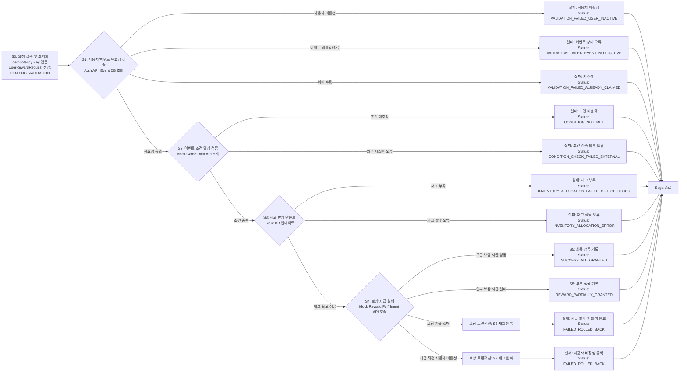
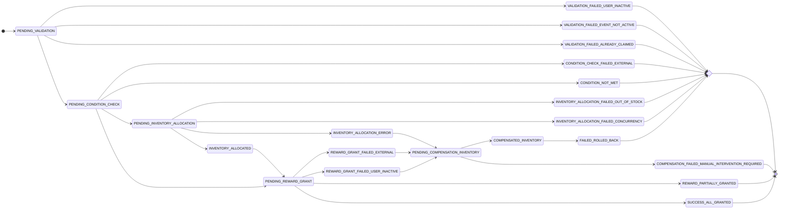
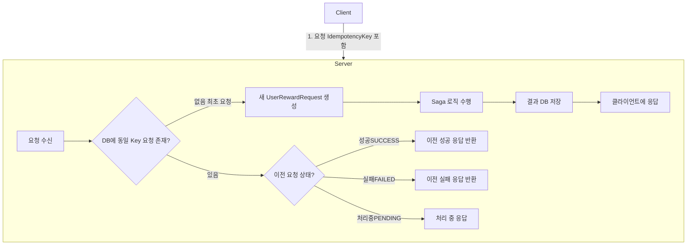

# Saga 패턴 및 멱등성 설계

## 1. 서론

본 문서는 "이벤트 / 보상 관리 플랫폼"의 핵심 트랜잭션인 **사용자 보상 요청 처리** 과정의 안정성 및 데이터 일관성 확보 목적의 Saga 패턴 적용 전략과 API 요청의 멱등성(Idempotency) 확보 방안 기술. 마이크로서비스 아키텍처(MSA) 환경의 부분적 실패(Partial Failures)에 대한 효과적 대응 및 모든 사용자에 대한 일관된 서비스 경험 제공을 최우선 목표로 설정. 본 설계는 현재의 동기식 API 통신 기반 시스템을 기준으로 하되, 향후 비동기 메시지 큐(예: Apache Kafka) 도입을 통한 확장 가능성 염두.

## 2. 사용자 보상 요청 처리 Saga (User Reward Claim Saga)

### 2.1. Saga 정의, 목표 및 참여 액터

- **Saga 명칭:** 사용자 보상 요청 처리 (User Reward Claim Saga)
- **핵심 목표:**
    - 사용자 특정 이벤트 보상 요청 접수 및 유효성 검증 (사용자 상태, 이벤트 상태, 기수령 여부).
    - 이벤트 조건 충족 여부의 정확한 판정.
    - 한정 수량 보상의 경우, 재고의 일관성 있는 확인 및 차감 (현재 설계: 단순화된 DB 업데이트 방식 채택).
    - 검증된 조건 및 재고 상태 기반의 보상 지급 실행 (외부 시스템 연동: Mock 인터페이스 가정).
    - Saga 전 과정의 상태 변화 추적 가능 형태 기록 (`UserRewardRequest` 문서).
    - Saga 진행 중 예외 발생 시, 기완료 선행 단계 작업의 안전한 **롤백(보상 트랜잭션 실행)**을 통한 데이터의 최종적 일관성(Eventual Consistency) 보장.
- **주요 참여 액터 및 역할:**
    - **Client (사용자 인터페이스):** 보상 요청 API 호출 (`X-Idempotency-Key` 헤더 포함).
    - **Gateway Server:** API 요청 수신, 1차 인증(JWT 유효성 검증), Event Server로의 프록시. `X-User-ID`, `X-User-Roles`, `X-User-Name` 등 신뢰 사용자 식별 정보의 HTTP 헤더 추가 후 백엔드 서비스 전달.
    - **Event Server (주 담당: `EventClaimsService`):**
        - 본 Saga의 <strong>Orchestrator</strong> 역할 수행 (현재 동기 API 호출 기반).
        - `UserRewardRequest` 상태 객체를 통한 Saga 인스턴스 상태 관리 및 영속화.
        - 각 Saga 단계별 비즈니스 로직 실행 및 결과 기록.
        - 필요시 타 서비스(Auth Server, (가상) Game Data Service, (가상) Reward Fulfillment Service) API 호출을 통한 정보 조회 및 기능 실행 요청.
        - 단계별 실패 감지 및 정의된 보상 트랜잭션 실행 지시.
    - **Auth Server (API 제공자):** Event Server로부터 특정 `userId` 유효성(계정 활성 상태 등) 확인 요청 처리.
    - **(가상) Game Data Service (API 제공자 - Mock Interface):** Event Server로부터 특정 이벤트 조건(예: 퀘스트 완료, 활동 횟수) 사용자 데이터 조회 요청 처리. (현재 과제: Event Server 내 Mock 로직 또는 단순 DB 조회로 대체 가능).
    - **(가상) Reward Fulfillment Service (API 제공자 - Mock Interface):** Event Server로부터 실제 보상(아이템, 포인트 등) 지급 실행 요청 처리. (현재 과제: Event Server 내 Mock 로직으로 대체 가능).

### 2.2. Saga 전체 흐름도 (High-Level Flowchart)

사용자 보상 요청 처리 Saga의 전체적 진행 흐름. 각 단계는 `UserRewardRequest` 상태 변화와 밀접한 연관.

- **설명:** 본 다이어그램은 Saga의 주요 단계와 각 단계의 성공/실패에 따른 분기, 그리고 보상 트랜잭션으로 이어지는 경로 시각화. 각 단계 결과는 `UserRewardRequest` 상태 변경과 연동. (상세 설명은 다음 상태 전이 다이어그램 및 `docs/02_Data_Model.md` 참조).

### 2.3. `UserRewardRequest` 상태 전이 다이어그램 (State Transition Diagram)

`UserRewardRequest` 문서의 `status` 필드는 Saga 진행 상황의 핵심 지표. 가능한 모든 상태와 상태 간 전이 조건은 아래와 같음.

- **설명:** 각 원은 `UserRewardRequest`의 `status` 값, 화살표는 상태 전이와 주요 원인(Saga 단계/이벤트) 의미.
- Saga의 복잡한 상태 변화 추적 및 관리 가능.
- 각 상태값 상세 의미는 `docs/02_Data_Model.md`의 `user_reward_requests` 컬렉션 설명 참조 또는 하단 표 추가.

### 2.4. 현재 설계: 동기 API 호출 기반 Orchestration Saga 상세

현재 시스템: Event Server의 `EventClaimsService`가 Orchestrator. Saga 각 단계 순차 실행, 외부 서비스(Auth Server, (가상) Game Data, (가상) Reward Fulfillment)는 동기식 HTTP API 호출(현재 Mock 처리)로 상호작용.

- **S0: 요청 접수 및 초기화 (`EventClaimsService.initiateClaim`)**
    - **입력:** `userId`, `eventIdString`, `idempotencyKey` (클라이언트 `X-Idempotency-Key`), `userRoles`, `username` (Gateway 헤더).
    - **주요 로직:**
        1. **멱등성 검증:** `idempotencyKey` 기반 `UserRewardRequest` 기존 요청 조회.
            - **기존 요청 존재 시:** `status` 기반 응답 처리 (성공 시 이전 결과, 처리 중 시 알림, 실패 시 이전 실패 결과/정책적 재시도). 신규 Saga 생성 방지.
        2. **대상 이벤트 조회:** `eventIdString` 기반 `events` 컬렉션 정보 조회. 부재 시 `NotFoundException`.
        3. **신규 `UserRewardRequest` 생성:** `requestId`, `userId`, `eventId`, 초기 `status` (`PENDING_VALIDATION`), `currentSagaStep` (`VALIDATE_USER_AND_EVENT`), `eventSnapshot`, `rewardsToProcess` (초기 상태 `PENDING`) 등 포함 문서 생성.
        4. **DB 저장:** 생성 문서 저장 (`requestId` unique 인덱스 활용 동시성 제어, 저장 실패 시 재조회 또는 `ConflictException`).
        5. **Saga 실행 트리거:** 후속 `processRewardClaimSaga` 호출 (현재 동기 흐름 가정, 비동기 시 Kafka 커맨드 이벤트 발행 고려).
    - **출력 (API 응답):** 생성/조회된 `UserRewardRequest` 초기 상태 정보 (또는 HTTP 202 Accepted).
- **S1: 사용자 및 이벤트 유효성 검증 (`processRewardClaimSaga` 내)**
    - **입력:** `UserRewardRequest` 객체.
    - **주요 로직:**
        1. **사용자 상태 검증 (Auth Server API 호출 - Mock 가정):** `request.userId` 사용, (가상) `/users/{userId}/status` API 호출, 사용자 활성 상태 확인.
            - **실패/엣지:** Auth Server 응답 지연/오류 시 Timeout/Retry 후 `status`=`VALIDATION_FAILED_EXTERNAL_AUTH`, `failureReason` 기록, Saga 중단.
            - 사용자 비활성 시 `status`=`VALIDATION_FAILED_USER_INACTIVE`, Saga 중단.
        2. **이벤트 상태/기간 검증 (Event DB 조회):** `request.eventId` 사용, `events` 컬렉션 재조회 (또는 `eventSnapshot` 활용), 이벤트 `status`(`ACTIVE`), 기간 유효성 검증.
            - 조건 미충족 시 `status`=`VALIDATION_FAILED_EVENT_NOT_ACTIVE`, Saga 중단.
        3. **중복 수령 검증 (Event DB 조회):** `(userId, eventId)` 기준, 기 성공(`SUCCESS_ALL_GRANTED` 등) `UserRewardRequest` 확인.
            - 중복 시 `status`=`VALIDATION_FAILED_ALREADY_CLAIMED`, Saga 중단.
    - **출력 (상태 변경):** 모든 검증 통과 시 `request.status`=`PENDING_CONDITION_CHECK`, `currentSagaStep`=`CHECK_CONDITIONS` 업데이트 후 DB 저장.
- **S2: 이벤트 조건 달성 여부 검증 (`processRewardClaimSaga` 내)**
    - **입력:** `UserRewardRequest` 객체 (특히 `eventSnapshot.conditions`).
    - **주요 로직:**
        1. **조건 데이터 조회 ((가상) Game Data Service API 호출 - Mock 가정):** `eventSnapshot.conditions` 명시 조건 유형 기반, 필요 사용자 활동 데이터 (가상) Game Data Service 조회.
            - **실패/엣지:** 외부 서비스 응답 지연/오류 시 Timeout/Retry 후 `status`=`CONDITION_CHECK_FAILED_EXTERNAL`, `failureReason` 기록, Saga 중단.
        2. **조건 충족 판정:** 조회 데이터와 `eventSnapshot.conditions` 비교, 최종 조건 충족 여부 판정.
            - 조건 미충족 시 `status`=`CONDITION_NOT_MET`, Saga 중단.
    - **출력 (상태 변경):** 조건 충족 시, 한정 수량 보상 존재 여부에 따라 `status`를 `PENDING_INVENTORY_ALLOCATION` (한정) 또는 `PENDING_REWARD_GRANT` (무제한)로, `currentSagaStep`을 각각 `ALLOCATE_INVENTORY` 또는 `GRANT_REWARDS`로 업데이트 후 DB 저장.
- **S3: 보상 재고 확인 및 반영 (단순화된 DB 업데이트, `processRewardClaimSaga` 내)**
    - **입력:** `UserRewardRequest` 객체 (`eventSnapshot.rewards` 또는 `rewardsToProcess`).
    - **주요 로직 (각 한정 수량 보상 대상):**
        1. `events` 컬렉션 내 해당 보상(`rewardId`)의 `remainingStock` 조건부 차감 시도.
            - **실패/엣지 (재고 부족/DB 업데이트 경쟁 실패):** `status`=`INVENTORY_ALLOCATION_FAILED_OUT_OF_STOCK` (또는 `..._CONCURRENCY`/`..._ERROR`), `failureReason` 기록. **S3 보상 트랜잭션 실행** (기 차감 다른 보상 재고 원복). Saga 중단.
        2. `rewardsToProcess` 내 해당 보상 상태 `INVENTORY_ALLOCATED` 업데이트.
    - **출력 (상태 변경):** 모든 필요 보상 재고 확보 시 `status`=`PENDING_REWARD_GRANT`, `currentSagaStep`=`GRANT_REWARDS` 업데이트 후 DB 저장.
    - **S3 보상 트랜잭션 (S3c):** 차감 `remainingStock` 원복 (DB 업데이트).
- **S4: 실제 보상 지급 ((가상) Reward Fulfillment Service API 호출 - Mock, `processRewardClaimSaga` 내)**
    - **입력:** `UserRewardRequest` 객체 (`rewardsToProcess` 중 `INVENTORY_ALLOCATED` 상태 보상).
    - **주요 로직 (각 지급 대상 보상 대상):**
        1. **사용자 상태 최종 확인 (Auth Server API 호출 - Mock 가정):** 지급 직전 사용자 활성 상태 재확인.
            - 비활성 시 해당 보상 `rewardsToProcess[i].grantStatus`=`FAILED_USER_INACTIVE`. 전체 Saga 롤백 절차 진입 (`status`=`REWARD_GRANT_FAILED_USER_INACTIVE`).
        2. (가상) Reward Fulfillment Service API 호출 (예: `POST /grant-item`).
            - **실패/엣지:** 외부 시스템 응답 지연/오류 시 Timeout/Retry 후 해당 보상 `rewardsToProcess[i].grantStatus`=`FAILED_EXTERNAL`, `failureReason` 기록.
        3. 성공 시 해당 보상 `rewardsToProcess[i].grantStatus`=`SUCCESS`, `processedAt` 기록.
    - **출력 (상태 변경 및 S4 보상 트랜잭션):**
        - **전체 성공 시:** `status`=`SUCCESS_ALL_GRANTED`, `currentSagaStep`=`COMPLETED`, `rewardsGrantedAt` 기록. Saga 성공 종료.
        - **부분 성공/실패 (All-or-Nothing 정책 가정):** `status`=`REWARD_GRANT_FAILED_EXTERNAL` (또는 `..._USER_INACTIVE`) 등 변경. **S4 보상 트랜잭션 실행** (기 성공 지급 보상 회수 시도 - Mock) 및 **S3 보상 트랜잭션 실행** (할당 재고 원복). 최종 `status`=`FAILED_ROLLED_BACK`. Saga 실패 종료.
        - **(정책) 부분 성공 허용 시:** `status`=`REWARD_PARTIALLY_GRANTED`. 실패 보상 부분 롤백. Saga 부분 성공 종료.
    - **S4 보상 트랜잭션 (S4c):** 기 성공 지급 보상 회수 시도 로직 (Mock).
- **S5: 최종 처리 및 완료 (`processRewardClaimSaga` 내)**
    - Saga 최종 상태(`SUCCESS_ALL_GRANTED`, `FAILED_ROLLED_BACK`, `REWARD_PARTIALLY_GRANTED` 등) `UserRewardRequest` 확정 기록.
    - 필요시 감사 로그 생성.

### 2.5. 현재 설계(동기 API 기반 Orchestration Saga)의 어려움 및 한계점

현재 제안된 동기식 API 호출 기반 Orchestration Saga 방식은 명확한 제어 흐름을 제공하나, 몇 가지 본질적인 어려움과 한계점 내포. 이는 특히 시스템 규모 확장 또는 트랜잭션 복잡도 증가 시 더욱 두드러질 수 있음.

1. **롤백(보상 트랜잭션) 로직의 중앙 집중화 및 복잡성 증가:**
    - **중앙 집중화된 오류 처리 부담:** Saga 조정자(Orchestrator, 현재 `EventClaimsService`)의 각 단계 실패 감지 및 순차적 보상 트랜잭션 실행 책임. 이는 Orchestrator 코드 복잡도 증가 및 유지보수 부담 야기. (새 Saga 단계 추가/변경 시 보상 로직 동시 수정 필요).
    - **구현의 어려움:** 각 서비스 호출(S1-S4 등)에 대한 보상 로직(API 호출, DB 롤백)의 Orchestrator 직접 관리. 예: S4 실패 시 S3 및 이전 단계 변경사항의 순차적, 성공적 롤백 확인 필요. 오류 발생 가능성 높은 지점.
    - **상태 관리의 복잡성:** 실패 지점 및 기완료 작업의 정확한 추적, 올바른 보상 조치를 위한 상태 관리의 중요성 증대 및 Orchestrator 로직 복잡화.
2. **서비스 간 강한 결합(Tight Coupling) 및 성능 병목 현상:**
    - **실행 시간 의존성:** `EventClaimsService`의 외부 서비스(Auth, Game Data, Reward Fulfillment) 동기 호출 방식은 호출 대상 서비스 응답 지연 시 전체 Saga 처리 시간 직접적 증가 야기. 여러 외부 시스템 순차 통신 시 지연 누적으로 사용자 경험 저하.
    - **가용성 의존성:** 호출 대상 서비스 장애 시 Orchestrator 블로킹 또는 타임아웃 후 Saga 실패 처리. 특정 서비스 장애가 전체 보상 시스템 가용성에 직접 영향 (강결합).
    - **Resilience 패턴 구현 부담:** 각 동기 API 호출 지점마다 Timeout, Retry(멱등성 보장 시), Circuit Breaker 등 Resilience 패턴의 Orchestrator 또는 호출 클라이언트 라이브러리 수준 개별 적용 및 관리 필요.
3. **긴 트랜잭션(Long-Lived Transactions)으로 인한 자원 점유:**
    - 전체 단계 동기 처리로 Saga 완료까지 관련 시스템 자원(DB 커넥션, 서버 스레드 등) 점유. 트랜잭션 처리량 증가 시 시스템 전체 성능 저하 유발 가능성.

위 어려움들은 "일일이 트랜잭션 다 되돌리는 게 너무 빡세다"는 통찰과 일치. 시스템 복잡도/트랜잭션 빈도 낮을 시 관리 가능하나, 서비스 성장에 따라 유지보수 및 확장 어려움 직면.

### 2.6. 향후 확장 설계: Apache Kafka 도입을 통한 Saga 개선 방안

동기 API 기반 Saga 한계 극복 및 시스템 확장성, 유연성, 서비스 간 결합도 개선을 위한 핵심 방안으로 Apache Kafka 등 메시지 큐 도입을 통한 이벤트 기반 아키텍처(EDA) 점진적 전환 고려.

- **핵심 목표:**
    - 서비스 책임 명확 분리 및 직접 동기 호출 의존성 제거 통한 **느슨한 결합(Loose Coupling)** 달성.
    - 시간 소요 작업 및 외부 시스템 의존 작업의 **비동기 이벤트 처리** 전환 통한 시스템 응답성 및 처리량 향상.
    - Saga 각 단계 이벤트 정의, 실패 시 **보상 이벤트** 기반 각 서비스 책임 하의 롤백 로직 수행으로 복잡성 분산.
- **개선 방안 1: Choreography 기반 Saga (이벤트 기반 완전 분산 처리)**
    - **개념:** 중앙 Orchestrator 부재. 각 마이크로서비스의 로컬 트랜잭션 완료 후 Kafka로 이벤트 발행(Publish). 타 서비스는 해당 이벤트 구독(Subscribe) 후 다음 작업 수행 및 필요시 추가 이벤트 발행 (연쇄적 진행).
    - **장점:** 서비스 간 결합도 극소화, 각 서비스 독립적 개발/배포/확장 용이성 극대화. 특정 서비스 장애의 타 서비스 영향 최소화 (시간적 분리).
    - **단점 및 과제 적용 시 고려사항:** 전체 Saga 흐름 추적 및 모니터링, 디버깅 복잡성 증가. 타임아웃 처리, 전체 Saga 실패 감지, 최종 롤백 조정 등의 로직 복잡화. (본 과제에서는 개념적 이해 제시 수준 권장).
- **개선 방안 2: Orchestration + Event 기반 Saga (하이브리드 - 현실적 절충안)**
    - **개념:** `EventClaimsService` 등 Orchestrator 역할 유지. 단, 시간 소요 또는 외부 시스템 의존 단계 실행을 동기 API 호출 대신, 해당 작업 요청 **커맨드(Command)성 이벤트를 Kafka로 발행**. 작업 결과는 **결과(Result) 이벤트를 Kafka로 구독**하여 다음 단계 진행 또는 실패 처리.
    - **장점:**
        - **흐름 제어 명확성 유지:** Orchestrator의 전체 Saga 흐름 관리로 Choreography 대비 이해 및 제어 용이.
        - **비동기 이점 활용:** 장기 실행 작업 비동기화로 API 응답성 및 시스템 자원 효율성 향상.
        - **롤백 로직 유연성:** 실패 시 Orchestrator의 보상 커맨드 이벤트(예: `CompensateInventoryCommand`) 발행. 담당 서비스/컨슈머의 해당 이벤트 구독 후 자체 작업 되돌림. "일일이 되돌리는" 로직의 Orchestrator 집중 완화 및 담당 서비스로 책임 분산 (중앙 통제는 유지).
        - **Resilience 향상:** Kafka의 메시지 버퍼 역할로 특정 커맨드 처리 서비스 일시 다운 시에도 커맨드 이벤트 유실 방지 및 추후 처리 가능. 각 컨슈머의 자체 재시도 로직 구현.
    - **Kafka 도입 시 "롤백" 처리 변화:** Orchestrator는 보상 로직 직접 수행 대신, "재고 원복 지시", "지급 포인트 회수 지시" 등 **보상 커맨드 이벤트 발행** 역할. 실제 롤백은 해당 커맨드 구독 서비스/컨슈머가 담당. Orchestrator 복잡도 감소 및 각 서비스의 책임 영역 내 롤백 수행으로 독립성 증진. (단, 보상 커맨드 이벤트 및 컨슈머 로직의 신중한 설계 필요).
    - **Kafka 이벤트 페이로드 예시 (Orchestration + Event 기반):**
        - **커맨드 이벤트 (Event Server Orchestrator → Kafka → 담당 컨슈머):**
            - `CheckEventConditionsCommand`: `{ "requestId": "uuid", "userId": "string", "eventId": "string", "eventConditionsSnapshot": {...} }`
            - `AllocateInventoryCommand`: `{ "requestId": "uuid", "userId": "string", "eventId": "string", "rewardsToAllocate": [{ "rewardId": "string", "quantity": 1 }] }`
            - `GrantRewardItemCommand`: `{ "requestId": "uuid", "userId": "string", "itemDetails": {...}, "idempotencyKeyForGrant": "uuid" }`
            - `CompensateInventoryCommand`: `{ "requestId": "uuid", "eventId": "string", "rewardsToRollback": [{ "rewardId": "string", "quantity": 1 }] }`
        - **결과 이벤트 (담당 컨슈머 → Kafka → Event Server Orchestrator):**
            - `EventConditionsCheckedEvent`: `{ "requestId": "uuid", "met": true/false, "reasonIfFalse": "string", "checkedDataSnapshot": {...} }`
            - `InventoryAllocatedEvent`: `{ "requestId": "uuid", "allocationStatus": "SUCCESS" / "OUT_OF_STOCK" / "ERROR", "allocatedRewards": [...], "failureReason": "string" }`
            - `RewardItemGrantedEvent`: `{ "requestId": "uuid", "grantStatus": "SUCCESS" / "FAILED", "rewardId": "string", "failureReason": "string", "transactionIdFromProvider": "string" }`
            - `InventoryCompensatedEvent`: `{ "requestId": "uuid", "compensationStatus": "SUCCESS" / "FAILED", "rolledBackRewards": [...] }`

이러한 Kafka 기반 비동기 Saga 처리는 현재 시스템의 한계 극복 및 "실제 프로덕션 코드" 질문에 대한 더욱 설득력 있는 답변 방향 제시.

## 3. API 멱등성 확보 전략 (`X-Idempotency-Key`)

사용자 보상 요청 API (`POST /event-claims/{eventId}/claim`) 등 시스템 상태 변경 및 재시도 시 부작용 발생 가능 API의 멱등성 보장 필수.

- **핵심 처리 로직:**
    1. **클라이언트:** 최초 상태 변경 요청 시 고유 `X-Idempotency-Key` (예: UUID) 생성 후 HTTP 헤더 포함 전송. 네트워크 오류 등 재시도 시 **동일 `X-Idempotency-Key` 사용** 필수.
    2. **서버 (Event Server `EventClaimsService.initiateClaim`):**
        - `X-Idempotency-Key` 추출 후 `UserRewardRequest.requestId` 필드로 사용 (`unique` 인덱스 설정).
        - **최초 요청:** `requestId` 조회 시 기존 문서 부재 시, 신규 `UserRewardRequest` 생성 (초기 상태 `PENDING_VALIDATION` 등) 후 Saga 로직 시작.
        - **중복 요청:** `requestId`로 기존 문서 조회 성공 시:
            - **이전 성공 완료 (`status`가 `SUCCESS_ALL_GRANTED` 등):** 저장된 이전 성공 응답 반환 (또는 "이미 성공 처리됨" 메시지와 200 OK / 적절 상태 코드). (응답 내용 저장은 `UserRewardRequest`에 추가 필드 필요 가능).
            - **이전 실패 완료 (`status`가 `FAILED_*` 등):** 저장된 이전 실패 응답 반환 (또는 "이미 실패한 요청" 메시지와 적절 오류 상태 코드). (정책상 특정 실패 재시도 허용 가능하나, 멱등성은 동일 요청-동일 결과 원칙).
            - **이전 처리 중 (`status`가 `PENDING_*` 등):** "현재 요청 처리 중. 잠시 후 확인 요망." 메시지와 HTTP 429 (Too Many Requests) 또는 202 (Accepted) 상태 코드 반환. 신규 Saga 인스턴스 중복 생성 방지.
            <!-- end list -->
    - **키 유효 기간 (TTL):** 현재 설계는 `UserRewardRequest` 문서 자체에 키(`requestId`)와 처리 상태 저장, 문서 보관 정책이 키 유효 기간. (별도 캐시(예: Redis) 사용 시 TTL 설정(예: 24~48시간) 고려).

## 4. 주요 엣지 케이스 및 대응 방안 (표)

사용자 보상 요청 Saga 진행 중 발생 가능 주요 엣지 케이스, 시스템 감지 방법, 대응 전략, 최종 상태, 필요 보상 트랜잭션은 다음과 같음.

| 엣지 케이스 상황 | 발생 가능 Saga 단계 | 감지 방법 | 대응 전략 및 `UserRewardRequest` 상태 변화 | 보상 트랜잭션 필요 여부 및 내용 |
| --- | --- | --- | --- | --- |
| **사용자 탈퇴/밴** (보상 요청 처리 중 발생) | S1 (유효성 검증), S4 (지급 직전 최종 확인) | Auth Server API 응답 (사용자 상태 재확인) 또는 (향후 Kafka) Auth Server 발행 `UserDeactivatedEvent` 수신 | Saga 즉시 중단. `UserRewardRequest.status` = `VALIDATION_FAILED_USER_INACTIVE` (S1 감지) 또는 `REWARD_GRANT_FAILED_USER_INACTIVE` (S4 감지). `failureReason`에 "사용자 비활성" 기록. | S4에서 발생 및 S3 재고 할당 완료 시, 해당 재고 롤백 (`PENDING_COMPENSATION_INVENTORY` -> `COMPENSATED_INVENTORY`). S4에서 일부 보상 기 지급 시 해당 보상 회수 시도(Mock) (`PENDING_COMPENSATION_REWARD` -> `COMPENSATED_REWARD`). 최종 `FAILED_ROLLED_BACK`. |
| **이벤트 비활성/종료** (보상 요청 처리 중 발생) | S1 (유효성 검증), S4 (지급 직전 최종 확인 - 선택적) | Event DB 조회 (이벤트 `status` 및 `endDate` 재확인) | Saga 즉시 중단. `UserRewardRequest.status` = `VALIDATION_FAILED_EVENT_NOT_ACTIVE`. `failureReason`에 "이벤트 비활성 또는 기간 종료" 기록. | S4에서 발생 및 S3 재고 할당 완료 시, 해당 재고 롤백. |
| **한정 수량 보상 재고 소진** (단순화된 DB 업데이트 사용) | S3 (재고 반영) | Event DB 조건부 업데이트 결과 (0 row affected 또는 재고 &lt; 요청 수량) | `UserRewardRequest.status` = `INVENTORY_ALLOCATION_FAILED_OUT_OF_STOCK`. `failureReason`에 "재고 부족" 기록. Saga 종료. | 이전 다른 보상에 대한 부분적 재고 할당 시 해당 재고 롤백. (현재 설계: 각 보상 순차 또는 전체 일괄 처리). |
| **(Mock) 외부 보상 지급 시스템 오류/타임아웃** | S4 (보상 지급) | 외부 API 호출 HTTP 오류 응답(5xx 등), Timeout Exception, 네트워크 연결 오류 등 | 제한 횟수 재시도 (외부 API 멱등성 지원 또는 Event Server의 재시도 시 고유 트랜잭션 ID 전달로 외부 중복 처리 방지 가능 시). 최종 실패 시 `UserRewardRequest.status` = `REWARD_GRANT_FAILED_EXTERNAL`. `failureReason` 상세 오류 기록. 비즈니스 정책(All-or-Nothing/부분 성공) 기반 전체 롤백 또는 부분 성공 처리. | **All-or-Nothing:** S3 할당 전체 재고 롤백. S4 기 성공 지급 다른 보상 회수 시도(Mock). 최종 `FAILED_ROLLED_BACK`. **부분 성공 허용:** 실패 보상 관련 부분 롤백. |
| **Event Server 예기치 않은 재시작** (Saga 진행 중) | 모든 Saga 단계 | 서버 재시작 후, `status`가 `PENDING_*`인 `UserRewardRequest` 문서 조회. | 각 요청의 `currentSagaStep` 및 저장 정보 기반 Saga 안전 재개 시도 (각 단계 로직 멱등성 필수. DB 즉시 반영 중요). 재개 불가 시, 전체 변경 롤백 후 `FAILED_ROLLED_BACK` (또는 `COMPENSATION_FAILED_MANUAL_INTERVENTION_REQUIRED`) 처리. 장시간 `PENDING_*` 요청 타임아웃 처리 로직 필요. | 재개 불가 시, 해당 요청의 마지막 성공 Saga 단계까지 모든 작업 역순 보상 트랜잭션 실행. `compensatingActionsLog` 기록. |
| **동일 `X-Idempotency-Key`로 중복 요청** | S0 (요청 접수) | `requestId` (멱등성 키)로 `UserRewardRequest` 조회 시 기존 문서 발견. | 이전 요청 `status` 기반 응답: `SUCCESS_ALL_GRANTED` 시 이전 성공 결과 반환. `FAILED_*` 시 이전 실패 결과 반환 (정책상 재시도 가능). `PENDING_*` 시 "처리 중" 응답 (HTTP 429/202). 신규 Saga 인스턴스 생성 방지. | 없음. 기존 처리 결과 준수. |
| **DB 커넥션 오류 또는 일시적 쓰기 실패** | DB 접근 모든 단계 | MongoDB 드라이버 예외 (예: `MongoNetworkError`). | 일시적 네트워크 오류 시, 제한 횟수 DB 작업 재시도 (DB 드라이버/애플리케이션 레벨). 지속 실패 시 해당 Saga 단계 실패 처리 및 전체 Saga 롤백 절차 진행. `UserRewardRequest.status`를 `*_ERROR_DB` (예: `INVENTORY_ALLOCATION_ERROR_DB`) 등으로 변경, `failureReason` 기록. | 해당 단계까지 성공 진행 작업 전체 보상 트랜잭션 실행. |
| **Saga 보상 트랜잭션 자체의 실패** | 보상 트랜잭션 실행 단계 | 보상 API 호출 실패, 보상 DB 업데이트 실패 등. | 매우 심각. `UserRewardRequest.status` = `COMPENSATION_FAILED_MANUAL_INTERVENTION_REQUIRED` 변경. `failureReason` 및 `compensatingActionsLog` 상세 기록. **운영팀 즉시 알림** (모니터링 시스템 연동). 수동 데이터 복구 및 문제 해결 필요. |  |